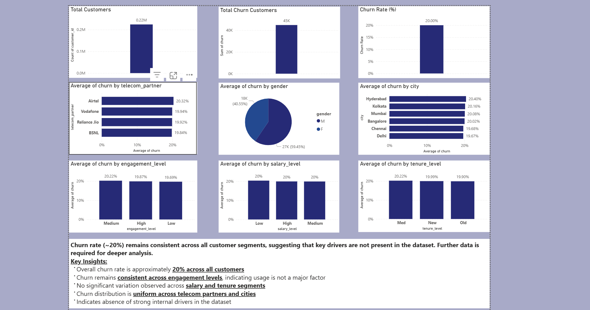

# telecom-churn-analysis
End-to-end customer churn analysis using Python and Power BI with segmentation insights

# Telecom Customer Churn Analysis

## Project Overview
This project focuses on analyzing customer churn behavior in a telecom dataset using Python and Power BI. The goal is to identify patterns and factors influencing customer churn through data analysis and visualization.

## Objective
- Analyze customer churn trends
- Perform segmentation based on customer behavior
- Identify key drivers (or lack of drivers) affecting churn

## Tools & Technologies
- Python (Pandas, NumPy)
- Power BI
- CSV Dataset

## Steps Performed
- Data cleaning (removed invalid/negative values)
- Feature engineering:
  - Engagement Score (calls + SMS + data usage)
  - Engagement Level (Low, Medium, High)
  - Salary Level segmentation
  - Tenure calculation from registration date
- Exploratory Data Analysis using groupby
- Churn rate comparison across multiple segments
- Dashboard creation in Power BI

---

## Dashboard Preview

## Key Insights
- Overall churn rate is approximately **~20% across all customers**
- Churn remains consistent across engagement levels
- No significant variation across salary and tenure segments
- Churn distribution is uniform across customer groups
- Indicates absence of strong internal drivers in the dataset

## Conclusion
The analysis shows that churn is evenly distributed across different customer segments. This suggests that important influencing factors (such as pricing, service quality, or customer complaints) are missing from the dataset and should be included for deeper analysis.

## Future Improvements
- Include pricing and billing data
- Analyze customer complaints and support interactions
- Incorporate network/service quality metrics
- Build predictive churn model (Machine Learning)

